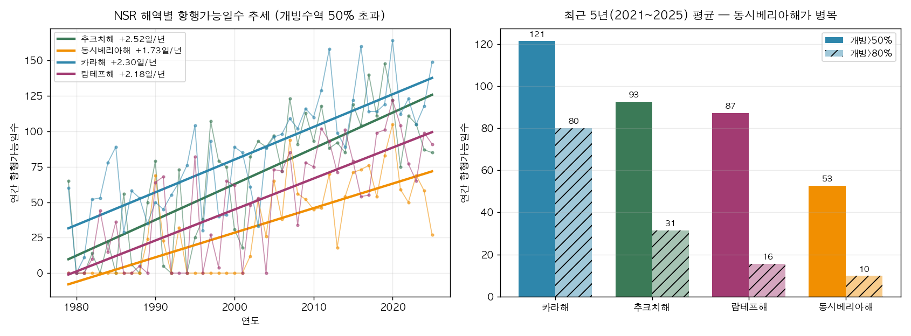
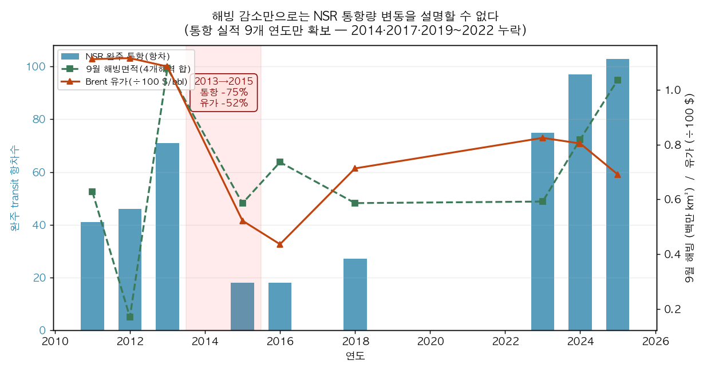
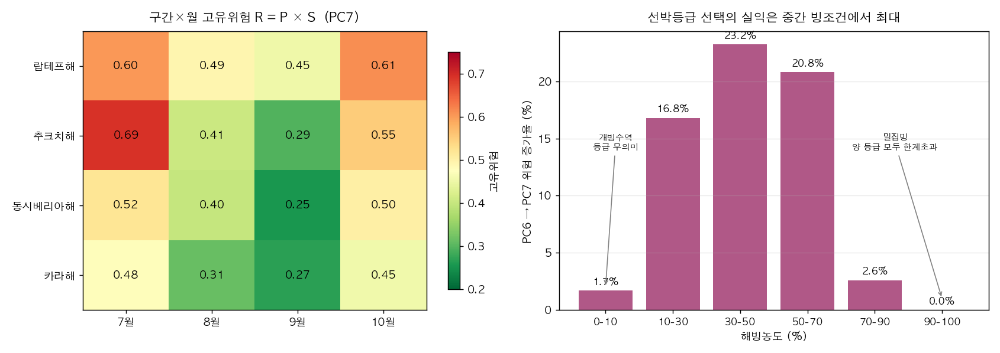
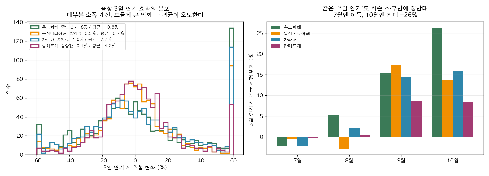

# AURORA 분석 결과 — 핵심 발견

**분석기간**: 2015~2024년 항행시즌(7~10월) / 해빙 장기추세는 1979~2025년
**공간범위**: NSR 4개 구간 — 카라해·랍테프해·동시베리아해·추크치해
**데이터**: NSIDC Sea Ice Index G02135 v4.0, ECMWF ERA5 single-levels, EIA Brent, CHNL 통항실적
**표본**: ERA5 일별 4,920 관측(4구간×1,230일), NSIDC 일별 69,592 관측

---

## 발견 1 — NSR의 병목은 동시베리아해다

4개 해역 모두 항행가능일수가 47년간 유의하게 증가했다(전부 p<10⁻⁸). 그러나 **증가했다는 사실보다 구간 간 격차가 훨씬 중요하다.**

| 해역 | 항행가능일수 추세 | 최근5년(2021~25) 개빙>50% | 개빙>80% |
|---|---|---|---|
| 카라해 | +2.30일/년 | **121일** | 80일 |
| 추크치해 | +2.52일/년 | 93일 | 31일 |
| 랍테프해 | +2.18일/년 | 87일 | 16일 |
| **동시베리아해** | +1.73일/년 | **53일** | **10일** |

동시베리아해의 항행가능일수는 카라해의 **44%**에 불과하다. 개빙수역 80% 초과 기준으로는 **12.5%**까지 벌어진다.

**시사점**: NSR 전 구간 완주 가능성은 평균이 아니라 최악 구간이 결정한다. 북극항로 위험을 항로 전체의 단일 지표로 제시하는 접근은 이 병목을 은폐한다. AURORA가 구간별 지수를 채택한 정량적 근거다.

> 정의 명시: 항행가능일 = 해당 해역 개빙수역 비율이 임계값을 초과한 날. 개빙수역 비율 = 1 − extent/해역면적. NSIDC extent는 농도 15% 이상 격자면적 합이므로 "얼음이 전혀 없음"이 아니라 "15% 미만"을 뜻한다. 해역면적은 기록상 최대 extent(겨울 포화값)로 근사했다. 이 지표는 물리적 접근가능성일 뿐 운항허가·경제성과 다르다.

---

## 발견 2 — 해빙 감소는 통항량 증가를 설명하지 못한다

확보된 9개 연도(2011~13, 2015~16, 2018, 2023~25)에서:

| 관계 | Spearman ρ | p | 판정 |
|---|---|---|---|
| 통항량 ~ 9월 해빙면적 | **+0.519** | 0.152 | n.s. |
| 통항량 ~ Brent 유가 | +0.326 | 0.391 | n.s. |
| 통항량 ~ 연도 | +0.544 | 0.130 | n.s. |

통항량과 9월 해빙의 상관은 **양(+)의 부호**다. 해빙이 많았던 해에 통항이 오히려 많았다는 뜻으로, "얼음이 녹아서 배가 늘었다"는 서사와 방향이 반대다. 다만 모두 통계적으로 유의하지 않다.

**핵심 반증사례 2013→2015**

| 지표 | 2013 | 2015 | 변화 |
|---|---|---|---|
| 완주 통항 | 71항차 | 18항차 | **−75%** |
| 9월 해빙(4해역 합) | 1,079,092 km² | 585,975 km² | −46% |
| Brent 유가 | $109 | $52 | −52% |

해빙 조건은 **더 좋아졌는데** 통항량은 4분의 1로 붕괴했다. 같은 기간 유가는 반토막이었다.

**주장 가능**: 해빙 단독으로는 통항량 변동을 설명할 수 없다.
**주장 불가**: 유가가 통항량의 원인이다. (n=9, 교란변수 다수, 인과 식별 불가)

> ⚠️ 한계: 통항 실적 9개 연도만 확보(2014·2017·2019~2022 누락). n=9는 어떤 상관계수도 검정력이 매우 낮다. 이 분석은 "해빙 결정론을 기각한다"는 방향으로만 쓰고, 대안 원인을 지목하는 데 쓰면 안 된다. **CHNL 리포트에서 누락 연도 재수집이 최우선 과제.**

---

## 발견 3 — 선박등급 선택의 실익은 중간 빙조건에서만 크다

해빙농도별로 PC6 대비 PC7의 위험 증가율을 분해했다.

| 해빙농도 | 관측일수 | PC6→PC7 위험증가율 |
|---|---|---|
| 0–10% | 214 | 1.7% |
| 10–30% | 465 | 16.8% |
| **30–50%** | 530 | **23.2%** |
| **50–70%** | 789 | **20.8%** |
| 70–90% | 1,073 | 2.6% |
| 90–100% | 511 | 0.0% |

**비단조 관계다.** 개빙수역에서는 등급이 무의미하고, 밀집빙에서는 두 등급 모두 한계를 넘어 역시 무의미해진다. 등급 상향의 실익은 **30~70% 구간에 집중**된다.

**시사점**: "PC 등급이 높을수록 항상 안전하다"는 선형 가정은 언더라이팅에서 비용 낭비를 낳는다. 등급 상향이라는 안전조치의 가치는 해당 항차가 마주할 빙조건 분포에 따라 결정되어야 한다. 이 구간별 차등이 Polar Safety Credit 설계의 실증 근거다.

### 구간별 위험 프로파일 (PC7, R = P × S)

| 구간 | 7월 | 8월 | 9월 | 10월 | 평균 |
|---|---|---|---|---|---|
| 랍테프해 | 0.603 | 0.492 | 0.452 | 0.612 | **0.540** |
| 추크치해 | 0.692 | 0.406 | 0.295 | 0.551 | 0.486 |
| 동시베리아해 | 0.519 | 0.399 | 0.255 | 0.502 | 0.419 |
| 카라해 | 0.478 | 0.313 | 0.268 | 0.455 | 0.378 |

전 구간 **9월 최저, 7월·10월 최고**의 U자 구조. 랍테프해가 연중 최고위험인데, 해빙(0.764)과 SAR 거리(Tiksi 511km) 양쪽이 모두 나쁘기 때문이다.

### 극지구조공백지수 PRGI

| 구간 | 최근접 SAR 거점 | 거리 | PRGI | 손실증폭 S |
|---|---|---|---|---|
| 카라해 | Dikson | 175 km | 0.00 | 1.00 |
| 동시베리아해 | Pevek | 419 km | 0.03 | 1.03 |
| 랍테프해 | Tiksi | 511 km | 0.18 | 1.18 |
| **추크치해** | Provideniya | **672 km** | 0.45 | **1.45** |

추크치해는 환경위험 자체는 중간이지만 구조 접근성이 최악이라 최종 위험 순위가 올라간다. **사고 가능성과 사고 결과를 분리해야 드러나는 구조**로, 단일 가중합 모델은 이를 포착하지 못한다.

### 가중치 민감도

Dirichlet 분포로 가중치를 1,000회 교란한 결과:
- 기준 대비 순위 Spearman 상관: 평균 **0.913**, 5퍼센타일 0.732
- 최고위험 구간×월(추크치해 7월) 1위 유지율 **69.3%**

가중치가 잠정값임에도 **구간 순위는 대체로 안정적**이다. 다만 5퍼센타일 0.732는 특정 가중치 조합에서 순위가 상당히 흔들릴 수 있음을 뜻하므로, 결론은 절대 점수가 아니라 순위와 그 불확실성으로 제시해야 한다.

---

## 발견 4 — "출항연기 = 안전"은 절반만 맞다 (가장 중요한 발견)

2015~2024년 실측 ERA5로 출항일을 k일 늦췄을 때의 위험 변화를 계산했다.

| 구간 | 연기 | 평균변화 | **중앙값** | 악화확률 |
|---|---|---|---|---|
| 추크치해 | 3일 | **+10.8%** | **−1.8%** | 47.6% |
| 동시베리아해 | 3일 | +6.7% | −0.5% | 49.2% |
| 카라해 | 3일 | +7.2% | −1.0% | 48.6% |
| 랍테프해 | 3일 | +4.2% | −0.1% | 49.6% |

**평균과 중앙값의 부호가 반대다.** 3일 연기는 절반 정도의 경우 위험을 소폭 낮추지만(중앙값 음수), 드물게 발생하는 큰 악화가 평균을 양수로 끌어올린다. 분포가 오른쪽으로 두껍게 늘어진 **꼬리위험 구조**다.

이것이 보험 관점에서 결정적인 이유: 평균 위험만 보고 할증을 산정하면 실제 손실 분포의 꼬리를 놓친다. 반대로 중앙값만 보면 "연기는 대체로 안전하다"는 잘못된 권고가 나온다. **두 통계량을 함께 제시해야만 의사결정이 가능하다.**

### 같은 3일 연기도 시점에 따라 정반대

| 구간 | 7월 | 8월 | 9월 | 10월 |
|---|---|---|---|---|
| 추크치해 | −2.3% | +5.3% | +15.4% | **+26.3%** |
| 동시베리아해 | −0.4% | −2.9% | +17.4% | +13.8% |
| 카라해 | −2.3% | +2.1% | +14.4% | +15.8% |
| 랍테프해 | −0.2% | +0.6% | +8.6% | +8.4% |

7월에는 연기가 이득(해빙이 계속 녹는 중), 10월에는 최대 **+26.3%** 손해(결빙·폭풍 시즌 진입). 시즌 후반의 연기는 안전조치가 아니라 **위험 가중 행위**다.

### 최저위험 출항시점

| 구간 | 최적일 | 최악일 | 격차 |
|---|---|---|---|
| 카라해 | 9월 16일 | 10월 30일 | +231% |
| 동시베리아해 | 9월 18일 | 10월 30일 | +233% |
| 추크치해 | 9월 21일 | 10월 30일 | +236% |
| 랍테프해 | 9월 23일 | 10월 21일 | +72% |

전 구간 **9월 중순~하순**이 최적. 같은 항로·같은 선박이라도 출항일 선택만으로 위험이 **2.3배** 차이 난다. 이는 AURORA가 제시하는 "위험을 낮추는 결정"의 정량적 크기다.

---

## 방법론 한계 (보고서에 반드시 명시)

1. **이 지수는 POLARIS가 아니다.** POLARIS RIO는 얼음 유형별 농도와 IMO 공식 RV표를 요구하나, ERA5 `siconc`는 총 농도만 제공하고 유형 구분이 없다. 임계값은 물리적으로 설명 가능한 잠정값이며 IMO MSC.1/Circ.1519 기반 교체가 필요하다.
2. **가시거리 직접 관측 없음.** ERA5 single-levels의 `visibility`는 MARS에서 ambiguous 에러가 발생해 사용 불가. 이슬점차(t2m−d2m)를 안개 프록시로 대체했다. 최초 임계값 5K는 실측 분포(중앙값 1.6K, 최대 6.2K) 대비 과대해 거의 전 구간이 포화됐고, 3K/0.5K로 보정했다.
3. **AIS 행동검증 미수행.** PAME ASTD 승인 대기 중. 현재 위험지수는 실제 선박의 감속·대기·우회 행동으로 검증되지 않았다. AURORA 차별화의 핵심 축이 아직 비어 있다.
4. **쇄빙지원 완화효과 η는 가정값.** 실측 검증이 불가능해 0.2/0.35/0.5 범위로만 제시했고, 절대 감소폭이 아니라 구간 간 순서만 해석했다.
5. **공간 집계 손실.** 구간을 사각형 박스로 근사하고 공간 평균·p90으로 축약했다. 실제 항로선(track) 기준이 아니므로 구간 내 항로 선택의 차이는 반영되지 않는다.
6. **통항 실적 결측.** 2014·2017·2019~2022년 누락으로 발견 2의 검정력이 낮다.

---

## 다음 단계 (우선순위)

1. **CHNL에서 누락 연도(2014·2017·2019~2022) 통항 실적 재수집** — 발견 2의 검정력 직결
2. POLARIS RIO 공식표(IMO MSC.1/Circ.1519) 적용해 임계값 교체
3. PAME ASTD 승인 후 AIS 감속·대기·우회로 위험지수 검증 (핵심 차별화 축)
4. 구간 박스 → 실제 NSR 항로선 기준 재집계
5. 발표자료·보고서에 발견 1·3·4 중심으로 반영 (발견 2는 한계와 함께)
