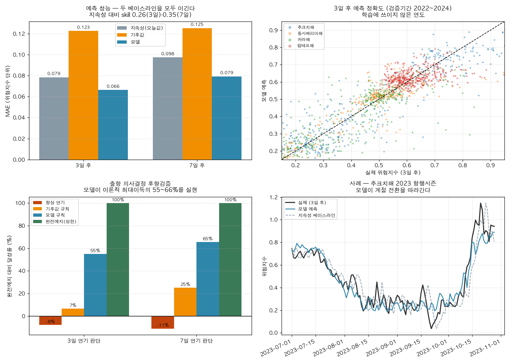
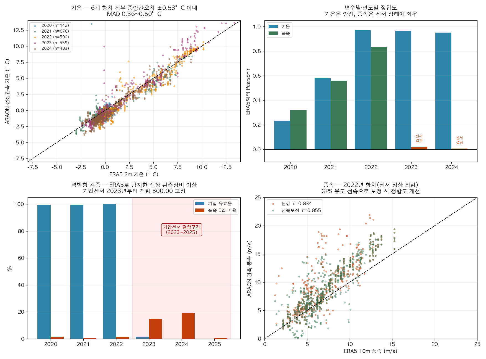

# AURORA 분석 결과 — 핵심 발견

**분석기간**: 2015~2024년 항행시즌(7~10월) / 해빙 장기추세는 1979~2025년
**공간범위**: NSR 4개 구간 — 카라해·랍테프해·동시베리아해·추크치해
**데이터**: NSIDC Sea Ice Index G02135 v4.0, ECMWF ERA5 single-levels, EIA Brent, CHNL 통항실적
**표본**: ERA5 일별 4,920 관측(4구간×1,230일), NSIDC 일별 69,592 관측

---

## 발견 1 — NSR의 병목은 동시베리아해다

4개 해역 모두 항행가능일수가 47년간 유의하게 증가했다(전부 p<10⁻⁸). 그러나 **증가했다는 사실보다 구간 간 격차가 훨씬 중요하다.**

| 해역 | 항행가능일수 추세 | 최근5년(2021~25) 개빙>50% | 개빙>80% |
|---|---|---|---|
| 카라해 | +2.30일/년 | **121일** | 80일 |
| 추크치해 | +2.52일/년 | 93일 | 31일 |
| 랍테프해 | +2.18일/년 | 87일 | 16일 |
| **동시베리아해** | +1.73일/년 | **53일** | **10일** |

동시베리아해의 항행가능일수는 카라해의 **44%**에 불과하다. 개빙수역 80% 초과 기준으로는 **12.5%**까지 벌어진다.

**시사점**: NSR 전 구간 완주 가능성은 평균이 아니라 최악 구간이 결정한다. 북극항로 위험을 항로 전체의 단일 지표로 제시하는 접근은 이 병목을 은폐한다. AURORA가 구간별 지수를 채택한 정량적 근거다.

> 정의 명시: 항행가능일 = 해당 해역 개빙수역 비율이 임계값을 초과한 날. 개빙수역 비율 = 1 − extent/해역면적. NSIDC extent는 농도 15% 이상 격자면적 합이므로 "얼음이 전혀 없음"이 아니라 "15% 미만"을 뜻한다. 해역면적은 기록상 최대 extent(겨울 포화값)로 근사했다. 이 지표는 물리적 접근가능성일 뿐 운항허가·경제성과 다르다.

---

## 발견 2 — (판단 보류) 해빙 결정론에 대한 사례 기반 반증

> ⚠️ **이 절은 통계적 결과가 아니라 사례 서술이다.** 확보 표본이 9개 연도(2011~13, 2015~16, 2018, 2023~25)뿐이라 어떤 상관계수도 검정력이 없다. 실제로 수행한 Spearman 상관은 전부 p=0.13~0.39로 유의하지 않았고, **유의하지 않은 상관계수의 부호를 해석하는 것은 통계적으로 허용되지 않으므로 본문에서 제외한다.** (수치는 `results/B_decoupling.csv`에 보존)
>
> 따라서 아래는 "상관분석 결과"가 아니라 **단일 사례의 반례 제시**로만 읽어야 한다. 반례는 전칭명제("해빙이 줄면 통항이 는다")를 약화시키는 데는 논리적으로 유효하지만, 대안 원인을 지목하는 데는 쓸 수 없다.

**반례: 2013→2015**

| 지표 | 2013 | 2015 | 변화 |
|---|---|---|---|
| 완주 통항 | 71항차 | 18항차 | **−75%** |
| 9월 해빙(4해역 합) | 1,079,092 km² | 585,975 km² | −46% |
| Brent 유가 | $109 | $52 | −52% |

해빙 조건은 **더 좋아졌는데** 통항량은 4분의 1로 붕괴했다. 같은 기간 유가는 반토막이었다.

**주장 가능**: 해빙 조건 개선만으로 통항량이 늘지는 않는다는 반례가 존재한다.
**주장 불가**: 해빙은 통항량과 무관하다 / 유가가 통항량의 원인이다. (n=9, 교란변수 다수, 인과 식별 불가)

**이 절의 지위**: 발견 1·3·4를 뒷받침하는 배경 논거이지 독립적 결과물이 아니다. 발표에서는 "우리 분석 결과"가 아니라 "이 프로젝트가 상대위험 지수를 택한 이유"로 배치할 것. **CHNL에서 누락 연도(2014·2017·2019~2022)를 재수집해 n을 15로 늘리는 것이 이 절을 결과물로 승격시키는 유일한 길이다.**

---

## 발견 3 — 선박등급 선택의 실익은 중간 빙조건에서만 크다

해빙농도별로 PC6 대비 PC7의 위험 증가율을 분해했다.

| 해빙농도 | 관측일수 | PC6→PC7 위험증가율 |
|---|---|---|
| 0–10% | 214 | 1.7% |
| 10–30% | 465 | 16.8% |
| **30–50%** | 530 | **23.2%** |
| **50–70%** | 789 | **20.8%** |
| 70–90% | 1,073 | 2.6% |
| 90–100% | 511 | 0.0% |

**비단조 관계다.** 개빙수역에서는 등급이 무의미하고, 밀집빙에서는 두 등급 모두 한계를 넘어 역시 무의미해진다. 등급 상향의 실익은 **30~70% 구간에 집중**된다.

**시사점**: "PC 등급이 높을수록 항상 안전하다"는 선형 가정은 언더라이팅에서 비용 낭비를 낳는다. 등급 상향이라는 안전조치의 가치는 해당 항차가 마주할 빙조건 분포에 따라 결정되어야 한다. 이 구간별 차등이 Polar Safety Credit 설계의 실증 근거다.

### 구간별 위험 프로파일 (PC7, R = P × S)

| 구간 | 7월 | 8월 | 9월 | 10월 | 평균 |
|---|---|---|---|---|---|
| 랍테프해 | 0.603 | 0.492 | 0.452 | 0.612 | **0.540** |
| 추크치해 | 0.692 | 0.406 | 0.295 | 0.551 | 0.486 |
| 동시베리아해 | 0.519 | 0.399 | 0.255 | 0.502 | 0.419 |
| 카라해 | 0.478 | 0.313 | 0.268 | 0.455 | 0.378 |

전 구간 **9월 최저, 7월·10월 최고**의 U자 구조. 랍테프해가 연중 최고위험인데, 해빙(0.764)과 SAR 거리(Tiksi 511km) 양쪽이 모두 나쁘기 때문이다.

### 극지구조공백지수 PRGI

| 구간 | 최근접 SAR 거점 | 거리 | PRGI | 손실증폭 S |
|---|---|---|---|---|
| 카라해 | Dikson | 175 km | 0.00 | 1.00 |
| 동시베리아해 | Pevek | 419 km | 0.03 | 1.03 |
| 랍테프해 | Tiksi | 511 km | 0.18 | 1.18 |
| **추크치해** | Provideniya | **672 km** | 0.45 | **1.45** |

추크치해는 환경위험 자체는 중간이지만 구조 접근성이 최악이라 최종 위험 순위가 올라간다. **사고 가능성과 사고 결과를 분리해야 드러나는 구조**로, 단일 가중합 모델은 이를 포착하지 못한다.

### 가중치 민감도

Dirichlet 분포로 가중치를 1,000회 교란한 결과:
- 기준 대비 순위 Spearman 상관: 평균 **0.913**, 5퍼센타일 0.732
- 최고위험 구간×월(추크치해 7월) 1위 유지율 **69.3%**

가중치가 잠정값임에도 **구간 순위는 대체로 안정적**이다. 다만 5퍼센타일 0.732는 특정 가중치 조합에서 순위가 상당히 흔들릴 수 있음을 뜻하므로, 결론은 절대 점수가 아니라 순위와 그 불확실성으로 제시해야 한다.

---

## 발견 4 — "출항연기 = 안전"은 절반만 맞다 (가장 중요한 발견)

2015~2024년 실측 ERA5로 출항일을 k일 늦췄을 때의 위험 변화를 계산했다.

| 구간 | 연기 | 평균변화 | **중앙값** | 악화확률 |
|---|---|---|---|---|
| 추크치해 | 3일 | **+10.8%** | **−1.8%** | 47.6% |
| 동시베리아해 | 3일 | +6.7% | −0.5% | 49.2% |
| 카라해 | 3일 | +7.2% | −1.0% | 48.6% |
| 랍테프해 | 3일 | +4.2% | −0.1% | 49.6% |

**평균과 중앙값의 부호가 반대다.** 3일 연기는 절반 정도의 경우 위험을 소폭 낮추지만(중앙값 음수), 드물게 발생하는 큰 악화가 평균을 양수로 끌어올린다. 분포가 오른쪽으로 두껍게 늘어진 **꼬리위험 구조**다.

이것이 보험 관점에서 결정적인 이유: 평균 위험만 보고 할증을 산정하면 실제 손실 분포의 꼬리를 놓친다. 반대로 중앙값만 보면 "연기는 대체로 안전하다"는 잘못된 권고가 나온다. **두 통계량을 함께 제시해야만 의사결정이 가능하다.**

### 같은 3일 연기도 시점에 따라 정반대

| 구간 | 7월 | 8월 | 9월 | 10월 |
|---|---|---|---|---|
| 추크치해 | −2.3% | +5.3% | +15.4% | **+26.3%** |
| 동시베리아해 | −0.4% | −2.9% | +17.4% | +13.8% |
| 카라해 | −2.3% | +2.1% | +14.4% | +15.8% |
| 랍테프해 | −0.2% | +0.6% | +8.6% | +8.4% |

### 이 결론 중 어디까지가 가중치와 무관한가 (중요)

위 수치는 모두 잠정 가중치의 함수다. 따라서 각주로 덮는 대신 **가중치를 1,000회 교란해 부호가 유지되는지 직접 측정**했다.

| 월 | 3일연기 효과 중앙값 | 5~95 퍼센타일 | **부호 유지율** |
|---|---|---|---|
| 7월 | −1.1% | −2.7 ~ +4.0 | 74.3% |
| 8월 | +2.7% | −2.4 ~ +15.6 | 77.0% |
| 9월 | +17.2% | +9.5 ~ +36.5 | **100%** |
| 10월 | +17.7% | +11.8 ~ +29.5 | **100%** |

**9월·10월의 위험 증가는 가중치를 어떻게 잡아도 부호가 뒤집히지 않는다(1,000회 중 0회).** 크기는 잠정이지만 방향은 가중치 선택과 무관하다.

반면 **"7월에는 연기가 이득"은 74%로 견고하지 않다.** 이 주장은 발표에서 하면 안 된다.

> **따라서 이 발견의 정확한 요약문은 다음과 같다.**
> ~~"같은 3일 연기가 7월엔 이득, 10월엔 26% 손해"~~ (앞 절반은 근거 부족)
> → **"시즌 후반의 출항연기는 위험을 키운다 — 가중치를 어떻게 잡아도."**

수치의 지위를 셋으로 구분해 제시할 것:

| 지위 | 해당 | 발표 가능 수준 |
|---|---|---|
| **견고** | 9·10월 연기의 위험증가 방향, 평균·중앙값 부호 불일치, 계절 U자 구조 | 단정 가능 |
| **잠정** | +26.3%, 2.3배 등 모든 절대 크기 | 범위로만 제시 |
| **근거부족** | 7·8월 연기 효과의 부호 | 제시 금지 |

### 최저위험 출항시점

| 구간 | 최적일 | 최악일 | 격차 |
|---|---|---|---|
| 카라해 | 9월 16일 | 10월 30일 | +231% |
| 동시베리아해 | 9월 18일 | 10월 30일 | +233% |
| 추크치해 | 9월 21일 | 10월 30일 | +236% |
| 랍테프해 | 9월 23일 | 10월 21일 | +72% |

전 구간 **9월 중순~하순**이 최적. 같은 항로·같은 선박이라도 출항일 선택만으로 위험이 **2.3배** 차이 난다. 이는 AURORA가 제시하는 "위험을 낮추는 결정"의 정량적 크기다.

---

## 발견 5 — 예측 가능한 만큼만 알고 결정해도 위험이 줄어든다

발견 4는 출항시점 선택이 위험을 크게 바꾼다는 것이었다. 그러나 실제 운항자는 **미래 위험을 모른 채** 결정해야 한다. 완전예지를 전제한 결론은 실무적으로 공허하다. 따라서 물어야 할 질문은 이것이다.

> 예측 오차를 감수하고 결정해도, 실제로 위험이 줄어드는가?

### 5-1. 예측 성능 — 두 베이스라인을 모두 이긴다

Gradient Boosting으로 구간별 위험지수를 예측했다. 학습 2015~2021, 검증 **2022~2024**(시간순 분할, 학습에 쓰이지 않은 연도).

| 예측시계 | 방법 | MAE | 지속성 대비 skill | 기후값 대비 skill |
|---|---|---|---|---|
| 3일 | 지속성(오늘값 유지) | 0.0785 | 0.000 | 0.557 |
| 3일 | 기후값(일자별 평균) | 0.1228 | −1.257 | 0.000 |
| 3일 | **모델** | **0.0664** | **0.258** | **0.671** |
| 7일 | 지속성 | 0.0975 | 0.000 | 0.307 |
| 7일 | 기후값 | 0.1254 | −0.444 | 0.000 |
| 7일 | **모델** | **0.0793** | **0.350** | **0.550** |

단기예측에서 이기기 어려운 **지속성 베이스라인을 3일 0.26 / 7일 0.35의 skill로 상회**한다. 4개 구간 전부에서 10~20% 개선되며, 검증 3개 연도의 MAE가 균일해 특정 연도 과적합이 아니다(3일: 0.0675 / 0.0625 / 0.0690).

### 5-2. 의사결정 후향검증 — 이론적 최대이득의 55~66% 실현

"지금 출항 vs h일 연기"를 실제로 판단하게 하고 실현위험을 비교했다.

| 규칙 | 3일 연기 판단 | 7일 연기 판단 |
|---|---|---|
| 항상 지금 출항 (기준) | 0% | 0% |
| 항상 연기 | **−7.9%** | **−11.1%** |
| 기후값 규칙(달력만 보고) | +6.5% | +25.2% |
| **모델 규칙** | **+54.9%** | **+65.5%** |
| 완전예지 (이론 상한) | 100% | 100% |

*완전예지 대비 달성률. 음수는 아무것도 안 하느니 못하다는 뜻.*

세 가지가 동시에 확인된다.

1. **"항상 연기"는 아무것도 안 하느니 못하다** (−7.9%, −11.1%). 발견 4의 결론이 독립적인 방식으로 재확인됐다.
2. **달력만으로는 거의 못 얻는다.** 기후값 규칙은 3일 판단에서 상한의 6.5%밖에 못 건진다.
3. **모델은 이론적 최대이득의 절반 이상을 실현한다.** 연기 판단의 적중률은 3일 73.2%, 7일 76.0%다.

즉 **예측모델을 쓸 실질적 이유가 있다.** 달력을 보는 것과 다른 결과를 만든다.

**독립 검증 — 롤링 외표본**: 위 결과는 단일 분할(학습 2015~21 / 검증 22~24)이다. 별도로 2020~2024년을 한 해씩 완전히 미관측 연도로 두는 롤링 검증을 수행한 결과도 같은 방향이다([06_deep_analysis_report.md](06_deep_analysis_report.md) §7).

| 예측거리 | 지속성 대비 평균 skill | 최악 연도 | 평균 실현위험 개선 | 완전예지 달성률 |
|---|---|---|---|---|
| 3일 | 0.305 | 0.222 | 5.6% (4.0~9.0%) | 60.8% |
| 7일 | 0.391 | 0.267 | 7.4% (5.4~12.0%) | 64.5% |

5개 평가연도 **전부**에서 skill과 의사결정 개선이 양수다. 분할 방식이 달라 수치는 다르지만 결론은 동일하다.

> ⚠️ **중요한 한계 — 이상화된 설정이다.** 여기서는 과거 ERA5 재분석으로 미래 ERA5 재분석을 예측했다. 실제 운항에서는 재분석이 아니라 수치예보(NWP)를 입력으로 써야 하고, 예보 자체의 오차가 추가된다. **따라서 이 결과는 "예측가능성이 존재한다"를 보이는 것이지, 운영 시스템이 같은 성능을 낸다는 뜻이 아니다.** 실운영 성능은 이 값보다 낮을 것이다.
>
> 또한 목표변수인 위험지수 자체가 잠정 가중치의 산물이다. 다만 지수의 주성분인 해빙·기온은 §검증에서 외부 관측과 일치함을 확인했다.

---

## 검증 — "이 지수가 맞다는 걸 무엇으로 아는가"

가중합 지수의 최대 약점은 검증 부재다. 현재 가능한 검증을 먼저 수행하고, 남은 공백을 명시한다.

### 검증1 — 해빙 입력자료가 독립 위성관측과 일치하는가

위험지수는 ERA5 재분석(모델+자료동화)으로만 만들었다. NSIDC는 수동마이크로파 위성관측으로 **산출 방식이 완전히 독립**이다.

| 구간 | Pearson r | Spearman ρ | n |
|---|---|---|---|
| 랍테프해 | **0.954** | 0.968 | 1,230 |
| 추크치해 | 0.913 | 0.944 | 1,230 |
| 카라해 | 0.911 | 0.914 | 1,230 |
| 동시베리아해 | 0.905 | 0.950 | 1,230 |

전 구간 r>0.90 (p<10⁻³⁰⁰). 지수의 해빙 성분은 독립 관측과 맞물린다.

### 검증2 — 지수가 지목한 최적시점이 물리적 실제와 맞는가

지수 계산에 NSIDC는 **전혀 사용하지 않았다.** 따라서 지수가 지목한 최저위험일이 NSIDC 관측의 최소빙일과 일치하는지는 진짜 외부 검증이 된다.

| 구간 | 지수 최저일 | NSIDC 최소빙일 | 차이 |
|---|---|---|---|
| 동시베리아해 | 9월 18일 | 9월 19일 | **1일** |
| 카라해 | 9월 16일 | 9월 17일 | **1일** |
| 추크치해 | 9월 21일 | 9월 17일 | 4일 |
| 랍테프해 | 9월 23일 | 9월 18일 | 5일 |

**평균 2.8일.** ERA5만으로 만든 지수가 독립 자료의 물리적 최적기를 2.8일 오차로 재현했다.

> 한계: 이 검증은 지수의 **해빙·계절 성분**만 확인한다. 파고·풍속·안개 성분의 가중치나 PRGI 손실증폭은 검증하지 못한다. 아래 검증3·4가 필요한 이유다.

### 검증3 (완료) — KPDC ARAON 선상 관측으로 ERA5 in-situ 검증

**KPDC 승인 완료. 6개 항차(2020~2025) 1초 간격 선상관측 12,189시간 확보.**

| 항목 | 내용 |
|---|---|
| 데이터 | `KOPRI-KPDC-00001463 / 00001704 / 00002146 / 00002359 / 00002855 / 00002994` |
| 원자료 확보 | 1초 간격, **6개 항차(2020~2025)**, 12,189시간 (4.8 GB) |
| ERA5 검증 대상 | **5개 항차(2020~2024)** — 2025년은 본 연구 ERA5 보유기간(2015~2024) 밖이라 대조 불가 |
| 매칭 표본 | 전체 **2,528행** / 그중 기온 유효쌍 **2,450쌍** |
| 구간별 매칭 | 추크치해 **1,326** / 동시베리아해 **1,202** |
| 변수 | 기온, 풍속·풍향, 기압, 습도, GPS 위치 |

아라온호는 척치해·동시베리아해를 실제 항행하는 국내 쇄빙연구선이다. 재분석 자료에만 의존한다는 약점을 국내 극지 관측자료로 직접 보완했다.

#### 결과 1 — 기온: ERA5는 실측과 0.5°C 이내로 일치

| 항차 | n | Pearson r | Spearman | 중앙값오차 | MAD | 이상치율 |
|---|---|---|---|---|---|---|
| 2020 | 142 | 0.233 | 0.234 | **−0.05** | 0.47 | 3.5% |
| 2021 | 676 | 0.580 | 0.716 | **−0.38** | 0.36 | 0.6% |
| 2022 | 590 | **0.971** | 0.911 | −0.53 | 0.50 | 1.0% |
| 2023 | 559 | **0.968** | 0.941 | −0.22 | 0.40 | 1.1% |
| 2024 | 483 | **0.951** | 0.899 | −0.45 | 0.45 | 0.2% |

**검증한 5개 항차 전부에서 중앙값오차 −0.53 ~ −0.05°C, MAD 0.36~0.50°C.** ERA5 2m 기온은 북극해 현장 관측과 사실상 일치한다.

2020·2021의 Pearson r이 낮은 것은 ERA5 오차가 아니라 **선상 센서의 산발적 이상치** 때문이다. 같은 해의 중앙값오차와 MAD는 다른 해와 동등하다. Pearson r만 보고했다면 "ERA5가 부정확하다"는 정반대 결론에 도달했을 것이다 — **강건통계를 병기해야 하는 이유의 실증 사례다.**

#### 결과 2 — 풍속: 부분 검증, 계통적 양(+)의 편의

센서 정상연도만 사용(2023·2024는 장비 결함으로 제외):

| 항차 | 원값 r | 선속보정 r | 중앙값오차 | 해석 |
|---|---|---|---|---|
| 2022 | 0.834 | **0.855** | +1.59 m/s | 보정이 개선 |
| 2021 | 0.559 | 0.561 | +1.07 m/s | 보정 효과 미미 |
| 2020 | 0.319 | 0.151 | +2.04 m/s | 보정이 악화 |

최량 항차(2022)에서 **GPS 유도 선속으로 보정하면 정합도가 개선된다**(r 0.834→0.855, RMSE 3.24→2.86). 즉 원자료 풍속에는 겉보기풍 성분이 섞여 있다. 다만 개선폭이 작고 연도별로 일관되지 않아 단정할 수 없다.

전 항차에서 **관측이 ERA5보다 +1.0~+2.0 m/s 높다.** 선상 풍속계는 마스트 상단(해면 약 25~30 m)에 설치되고 ERA5는 10 m 기준이므로 대수 풍속분포상 +10% 내외가 예상되며, 나머지는 선체 주변 유동교란으로 추정된다. **추정이며 검증하지 않았다.**

> **위험지수에 대한 함의**: 기온 성분은 검증됐다. 풍속 성분은 방향성은 맞으나 계통편의가 있어, 풍속 임계값(5~20 m/s)을 실측 기준으로 재보정할 여지가 있다.

#### 결과 3 (부산물) — ERA5가 관측장비 결함을 탐지했다

검증은 양방향으로 작동한다. 관측이 재분석을 검증하는 동시에, 재분석이 관측장비의 이상을 드러낸다.

| 항차 | 기압 유효율 | 풍속 0값 비율 | 풍속 p99 | ERA5 p99 | 판정 |
|---|---|---|---|---|---|
| 2020 | 99.5% | 1.5% | 21.6 | 11.0 | 정상 |
| 2021 | 99.3% | 0.5% | 15.6 | 12.5 | 정상 |
| 2022 | 100.0% | 1.2% | 18.9 | 13.8 | 정상 |
| **2023** | **1.6%** | 14.5% | 6.8 | 11.0 | 결함 |
| **2024** | **0.0%** | 19.0% | 6.7 | 11.2 | 결함 |
| **2025** | **0.0%** | 0.2% | — | — | 기압 결함 |

**아라온 기압센서는 2023년 중 고장나 2025년까지 미복구 상태다.** 결함 구간의 기압값은 전량 `500.00`으로 고정 기록되어 있다. 풍속계도 2023~2024년 이상(0값 20%대, p99가 ERA5의 60% 미만)을 보였다가 2025년 회복했다.

이는 KPDC에 회신할 가치가 있는 관측 결과다(데이터 이용 규정상 성과 보고 의무도 있다).

#### 방법론 메모 — QC 계층이 실제로 필요했던 이유

각 단계는 선험적 설계가 아니라 **실제 오류를 발견한 뒤** 도입했다.

1. **값 단위 물리범위 필터** — 기온 최대 115,645°C 등 명백한 파싱/센서 오류
2. **파일 단위 불량률 게이트(20%)** — 원자료의 85~99%가 범위 밖인 시간대가 존재했고, 잔존값 중앙값이 북위 73도 8월에 36°C였다. 값 단위 필터만으로는 걸러지지 않는다.
3. **기록 완결성 필터(≥3,000초/시간)** — 512~539초만 기록된 파일에서 −39.02°C 고정값 관측
4. **강건통계 병기** — 위 결과 1의 2020·2021 사례가 근거

풍향 규약은 기상학적 정의(불어오는 방향)를 가정했다. 상대방위 가설도 검정했으나 정합도가 더 나빠 기각했다.

### 검증4 — 행동검증 시도와 **실패** (중요)

PAME ASTD 승인 대기 중이나, ARAON 원자료에 1초 간격 GPS가 포함돼 있어 실제 쇄빙선 1척의 항적으로 대체 검증을 시도했다. 항해구간(선속 >2 m/s) 1,376시간 대상.

**핵심 검정**: 합성 위험지수가 해빙 단독보다 선박 감속을 잘 설명하는가? 설명하지 못하면 여러 변수를 결합할 이유가 없다.

| 결과 | 값 | 판정 |
|---|---|---|
| 합성지수 vs 선속 Spearman | **−0.034** (p=0.212) | 무관 |
| 합성지수의 해빙 대비 ΔR² | **−0.0003** | 개선 없음 |
| 고위험 분위(Q4) 감속 오즈비 | **0.74** | 가설과 **반대** |
| 해빙 계수 β | **+0.579** (p<0.001) | 얼음 많을수록 빨라짐, 반대 |

**검증 실패다.** 그리고 실패 원인은 표본 부족이 아니라 구조적 교란이다.

1. **얼음에서 배는 감속이 아니라 정지한다.** 정박비율이 개빙 30.0% → 밀집빙 **59.3%**로 증가한다. 그런데 정박은 연구정점 작업이므로 분석에서 제외했고, 결과적으로 **보려던 행동 자체를 걸러냈다.** 연구선은 얼음 정박이 임무이므로 위험반응과 분리가 불가능하다.
2. **저온 계수는 위도 대리변수다.** 위도·기온 상관 r=−0.888. "추우면 감속"이 아니라 "북쪽일수록 감속"이며 이는 임무 구조다.
3. **연도별 부호가 뒤집힌다.** 2020 −0.085 / 2021 +0.164 / 2022 −0.079 / 2023 +0.060 / 2024 −0.002. 유의한 건 2021뿐이고 그마저 양수다.

**근본 원인**: 아라온은 PC 고등급 쇄빙연구선이지 PC7 화물선이 아니다. **화물선이라면 회피할 조건에 임무상 의도적으로 진입한다.** 회피행동을 관측할 수 없는 선박으로 회피행동을 검증하려 한 것이다.

> **이 실패의 의미**: PAME ASTD 화물선 선단 AIS는 "있으면 좋은 것"이 아니라 행동검증에 **반드시 필요한 자료**임이 실증적으로 확인되었다. 대체재가 없다.

### 검증5 (승인 대기) — 화물선 선단 AIS 행동검증

PAME ASTD 승인 대기 중. **AURORA 차별화의 핵심 축이며 현재 공백이다.** 검증4의 실패로 이 자료에 대체재가 없음이 실증됐다. 이것이 없으면 본 지수는 "물리적으로 설명 가능한 임계값으로 만든, 입력자료는 검증됐고 예측은 가능하지만 결과와의 연결은 미확인인 가중합"이다.

### 현재 검증 상태 요약

| 검증 대상 | 자료 | 상태 |
|---|---|---|
| 해빙 입력자료 | NSIDC 위성관측(독립) | ✅ r=0.91~0.95 |
| 최적시점 | NSIDC 최소빙일(독립) | ✅ 평균 2.8일 차 |
| 기온 입력자료 | **KPDC ARAON 선상 in-situ** (5개 항차) | ✅ **중앙값오차 ±0.53°C, MAD 0.36~0.50°C** |
| 풍속 입력자료 | **KPDC ARAON 선상 in-situ** | ⚠️ 부분 — 최량항차 r=0.855, 계통편의 +1.0~2.0 m/s |
| 위험지수 vs 선박 행동(연구선) | KPDC ARAON GPS | ❌ **실패** — 연구선 임무 교란으로 검증 불가 |
| 위험지수 vs 선박 행동(화물선) | PAME ASTD | ⬜ 승인 대기 — 대체재 없음이 확인됨 |
| 예측가능성 | ERA5 시간순 분할 | ✅ 지속성 대비 skill 0.26~0.35 |
| 파고 가중치, PRGI 손실증폭 | — | ❌ 검증 수단 없음 |

세 자료(NSIDC 위성, KPDC 선상관측, ERA5 재분석)가 서로 독립이며, 위험지수 계산에는 ERA5만 사용했다. 나머지 둘은 순수한 외부 검증자료다.

---

## 방법론 한계 (보고서에 반드시 명시)

1. **이 지수는 POLARIS가 아니다.** POLARIS RIO는 얼음 유형별 농도와 IMO 공식 RV표를 요구하나, ERA5 `siconc`는 총 농도만 제공하고 유형 구분이 없다. 임계값은 물리적으로 설명 가능한 잠정값이며 IMO MSC.1/Circ.1519 기반 교체가 필요하다.
2. **가시거리 직접 관측 없음.** ERA5 single-levels의 `visibility`는 MARS에서 ambiguous 에러가 발생해 사용 불가. 이슬점차(t2m−d2m)를 안개 프록시로 대체했다. 최초 임계값 5K는 실측 분포(중앙값 1.6K, 최대 6.2K) 대비 과대해 거의 전 구간이 포화됐고, 3K/0.5K로 보정했다.
3. **AIS 행동검증 미수행.** PAME ASTD 승인 대기 중. 현재 위험지수는 실제 선박의 감속·대기·우회 행동으로 검증되지 않았다. AURORA 차별화의 핵심 축이 아직 비어 있다. 검증1~3이 입력자료(해빙·기온·풍속)의 타당성은 뒷받침하지만, **입력이 옳다는 것과 결합방식(가중치)이 옳다는 것은 별개 문제다.**
4. **쇄빙지원 완화효과 η는 가정값.** 실측 검증이 불가능해 0.2/0.35/0.5 범위로만 제시했고, 절대 감소폭이 아니라 구간 간 순서만 해석했다.
5. **공간 집계 손실.** 구간을 사각형 박스로 근사하고 공간 평균·p90으로 축약했다. 실제 항로선(track) 기준이 아니므로 구간 내 항로 선택의 차이는 반영되지 않는다.
6. **통항 실적 결측.** 2014·2017·2019~2022년 누락(n=9)으로 상관분석은 검정력이 없어 본문에서 제외했다. 발견 2는 사례 반증으로만 제시한다.
7. **풍속 계통편의 미보정.** ARAON 관측이 ERA5보다 +1.0~2.0 m/s 높다. 풍속계 설치고도(마스트 25~30 m vs ERA5 10 m)와 선체 유동교란이 원인으로 추정되나 검증하지 않았다. 위험지수의 풍속 임계값(5~20 m/s)은 이 편의를 반영하지 않은 상태다.
8. **파고·풍속 가중치와 PRGI 손실증폭은 검증 수단이 없다.** 민감도 분석은 '순위가 흔들리지 않는다'만 보여줄 뿐 '가중치가 옳다'를 보여주지 못한다.
9. **예측 결과는 이상화된 설정이다.** 과거 재분석으로 미래 재분석을 예측했다. 실운영에서는 수치예보를 입력으로 써야 하며 예보 오차가 추가되므로 성능은 이보다 낮아진다.
10. **검증된 것은 입력과 예측가능성이지 '위험'이 아니다.** 사고·손실 자료가 없으므로 지수를 '위험'이라 부르는 것은 여전히 해석적 도약이다. 엄밀히는 환경조건 종합지표다.

---

## 다음 단계 (우선순위)

**즉시**

1. ~~KPDC ARAON 기상관측 확보 및 검증~~ ✅ 완료 (6개 항차, 2,450시간 대조)
2. ~~행동검증 대체 시도~~ ✅ 완료 — 실패. 연구선으로는 불가함을 실증
3. ~~예측모델·의사결정 후향검증~~ ✅ 완료 — 상한의 55~66% 실현
4. **PAME ASTD 승인 상태 확인** — 유일하게 남은 공백이며 대체재 없음이 확인됨
5. 기압센서 결함(2023~2025) KPDC 회신 — 데이터 이용 규정상 성과 보고 의무이자, 데이터센터에 실질적으로 유용한 정보

**분석 보강**

3. CHNL에서 누락 연도(2014·2017·2019~2022) 통항 실적 재수집 — 발견 2를 사례에서 결과물로 승격시키는 유일한 경로
4. POLARIS RIO 공식표(IMO MSC.1/Circ.1519) 적용해 해빙 임계값 교체
5. 구간 박스 → 실제 NSR 항로선 기준 재집계

**산출물**

6. 발표자료·보고서 작성 — 발견 4를 축으로, 발견 1을 방법론 정당화로 배치. 발견 2는 배경 논거로 강등.

## 발표 시 유의사항

- **발견 4의 요약문**: "9월이 최적"으로 요약하면 업계 상식이라 죽는다. "**시즌 후반 연기는 가중치와 무관하게 위험을 키운다**"와 "**평균과 중앙값의 부호가 반대**"가 살아 있는 문장이다.
- **발견 1의 역할**: 결과이자 동시에 "왜 구간별로 복잡하게 했는가"에 대한 자기정당화. 심사위원의 복잡도 지적에 그대로 답이 된다.
- **수치 단정 금지**: 위 §발견4의 견고/잠정/근거부족 3분류를 지킬 것. 절대 크기를 단정하면 "그 가중치 근거가 뭐냐"로 무너진다.
- **검증 질문 대비**: "이 지수가 맞다는 걸 무엇으로 아는가"에는 검증2(독립 관측 최소빙일과 2.8일 차)로 답하되, 파고·풍속·PRGI는 검증 수단이 없음을 먼저 인정할 것.
