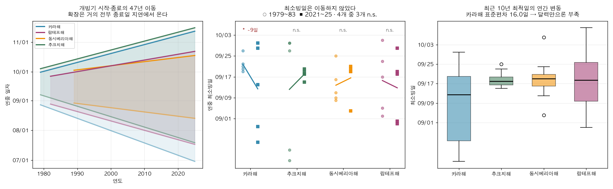

# 북극해항로 구간별 운항위험지수와 출항시점 의사결정

## 공개 해빙·기상 데이터와 국내 극지 관측자료를 결합한 검증 중심 접근

**2026 극지 빅데이터-인공지능 활용 경진대회 — 데이터 분석 부문**

---

## 요약

북극해항로(NSR) 4개 구간의 일별 상대 운항위험지수를 ERA5 재분석자료로 산출하고, 그 입력자료를 NSIDC 위성관측과 KPDC 아라온호 선상관측이라는 두 독립 자료로 교차검증하였다.

주요 결과는 다음과 같다. 첫째, 항행가능일은 동시베리아해가 카라해의 44%에 불과해 항로 전체가 아니라 구간 병목이 완주 가능성을 결정한다. 둘째, 안전조치로 통용되는 출항연기는 시즌 후반에 오히려 위험을 높이며(9월 +14.0%, 10월 +16.1%), 그 방향은 가중치 교란·연도 군집 재표집·결측 대체 방식 변경에서 모두 유지된다. 셋째, 3~7일 단기예측을 출항 판단에 적용하면 5개 평가연도 전부에서 실현위험이 낮아졌으며(5.6~7.4% 개선), 이는 달력만 참조하는 규칙이 얻는 이득의 두 배 이상이다.

본 연구는 검증되지 않은 부분을 명시하는 데 상당한 비중을 두었다. 입력자료는 외부 관측과 일치함을 확인했으나, 변수 결합 가중치와 구조공백 손실증폭 가정은 검증하지 못했다. 화물선 AIS 자료를 확보하지 못해 실제 선박 행동과의 대조도 수행하지 못했으며, 대체 검증 시도가 실패한 과정과 그 구조적 원인을 함께 기록하였다.

---

## 1. 배경

### 1.1 문제의식

북극 해빙 감소로 북극해항로의 상업적 이용이 논의되고 있다. 그러나 실제 운항자와 보험자가 마주하는 질문은 "북극이 얼마나 위험한가"라는 일반론이 아니라 "이 선박이 이 시점에 이 구간을 통과할 때 무엇을 감수해야 하는가"이다.

기존 평가체계인 POLARIS는 선박의 내빙능력과 얼음 조건을 결합해 **운항 가능 여부**를 판단한다. 이는 필수적이지만, 운항자가 통제할 수 있는 결정 — 특히 **언제 출항할 것인가** — 을 다루지 않는다.

본 연구는 다음 세 가지 질문에 답하고자 한다.

1. NSR의 위험은 구간별로 얼마나 다르며, 항로 전체 평균으로 보면 무엇을 놓치는가
2. 출항시점 선택이 위험을 얼마나 바꾸는가. 통용되는 "출항연기 = 안전"은 성립하는가
3. 미래를 모르는 상태에서 예측을 활용하면 실제로 더 나은 결정이 가능한가

### 1.2 선행 접근의 한계와 본 연구의 위치

북극 해빙 관측·예측 연구와 항로 최적화 연구는 각각 축적되어 있으나, 다음 지점이 비어 있다.

- 해빙 관측·예측 연구는 **"얼음이 어디에 얼마나 있는가"**에 답하지만 운항 의사결정과 직접 연결되지 않는다.
- 항로 최적화 연구는 **"어느 길이 빠르거나 경제적인가"**에 답하지만 시점 선택을 다루지 않는 경우가 많다.
- 위험지도 연구는 **"어느 구간이 위험한가"**를 보여주지만 정적이다.

본 연구는 **시점 축**에 집중한다. 같은 선박이 같은 구간을 통과하더라도 출항일에 따라 마주하는 조건이 달라진다는 점을 정량화하고, 그 차이를 예측 가능한 범위에서 활용할 수 있는지 검정한다.

### 1.3 검증에 대한 문제의식

가중합 형태의 위험지수는 만들기 쉽지만 검증하기 어렵다. 임계값과 가중치를 임의로 정하고 "위험지수"라 명명하면 그럴듯해 보이지만, 그 지수가 현실의 무엇과 대응하는지는 별개 문제다.

본 연구는 **검증 가능한 것과 불가능한 것을 분리**하는 데 상당한 비중을 두었다. 입력자료의 정확성은 독립 관측으로 검증할 수 있고, 결론의 방향성은 민감도 분석으로 확인할 수 있다. 그러나 변수 결합 방식의 타당성은 실제 사고나 선박 행동 자료 없이는 검증할 수 없다. 이 구분을 보고서 전반에 명시하였다.

---

## 2. 활용 데이터

### 2.1 데이터 목록

| 데이터 | 출처 | 기간·규모 | 용도 |
|---|---|---|---|
| ARAON DaDiS 선상 기상관측 | **KPDC** (극지연구소) | 2020~2025년 6개 항차, 1초 간격, 12,189시간 | ERA5 in-situ 검증 |
| Sea Ice Index G02135 v4.0 | **NSIDC** | 1979~2025년 일별, 69,592 관측 | 장기 추세, 독립 검증 |
| ERA5 single levels 재분석 | **ECMWF / Copernicus C3S** | 2015~2024년 7~10월, 4,920 관측 | 위험지수 입력변수 |
| Brent·WTI 국제유가 | **EIA** | 2010~2025년 일별 | 통항량 배경 검토 |
| NSR 통항 실적 | **CHNL** | 2011~2025년 중 9개 연도 | 해빙-통항 사례 검토 |

### 2.2 공간 범위

NSR을 4개 구간으로 분할하였다. 경계는 ERA5 다운로드 시 사용한 사각형 박스 기준이다.

| 구간 | 위도 | 경도 |
|---|---|---|
| 카라해 | 65~82°N | 55~95°E |
| 랍테프해 | 70~81°N | 95~145°E |
| 동시베리아해 | 68~77°N | 145~180°E |
| 추크치해 | 65~75°N | 180°E~155°W |

### 2.3 KPDC 자료의 위치

본 연구에서 KPDC 아라온호 선상관측은 **검증 자료**로 사용하였다. 아라온호는 척치해·동시베리아해를 실제 항행하는 국내 쇄빙연구선으로, 관측기간(7~9월)과 공간범위(북위 60~80도, 동경 160도~서경 150도)가 분석 대상과 직접 일치한다.

ERA5는 관측이 아니라 모델과 자료동화의 산물이다. 따라서 재분석값이 북극해 현장 조건을 실제로 대표하는지는 별도 확인이 필요하며, 선상 in-situ 관측이 그 역할을 한다.

| Entry ID | 항차 |
|---|---|
| KOPRI-KPDC-00001463 | Arctic cruise 2020 |
| KOPRI-KPDC-00001704 | Arctic cruise 2021 |
| KOPRI-KPDC-00002146 | Arctic cruise 2022 |
| KOPRI-KPDC-00002359 | Arctic cruise 2023 |
| KOPRI-KPDC-00002855 | Arctic cruise 2024 |
| KOPRI-KPDC-00002994 | Arctic cruise 2025 |

ERA5 보유기간과 겹치는 5개 항차(2020~2024)의 2,528시간을 대조 표본으로 사용하였다. 2025년 항차는 ERA5 기간(2015~2024) 밖이라 대조에서 제외하였다.

### 2.4 확보하지 못한 데이터

**PAME ASTD 화물선 AIS**를 신청하였으나 대회 기간 내 승인되지 않았다. 이는 본 연구의 가장 큰 제약이며, 그 결과와 대체 시도의 실패 과정을 §4.5에 기록하였다.

NSR 통항 실적은 CHNL 리포트에서 9개 연도만 확보하여(2014·2017·2019~2022년 결측) 통계적 상관분석에는 사용하지 않았다.

---

## 3. 분석 방법

### 3.1 위험지수 구조

사고 가능성과 사고 결과를 분리하였다. 단일 가중합은 두 개념을 섞어 해석을 어렵게 만들기 때문이다.

```
환경위험 P = Σ wᵢ · hᵢ,   hᵢ ∈ {해빙, 풍속, 파고, 저온, 안개}
손실증폭 S = 1 + λ · PRGI(최근접 SAR 거점 거리)
고유위험 R = P × S
```

각 성분은 물리적으로 설명 가능한 임계값으로 0~1 정규화하였다.

| 성분 | 하한(위험 0) | 상한(위험 1) | 근거 |
|---|---|---|---|
| 해빙농도 | 0.10 | 0.80 | 10% 미만 개빙수역 / 80% 초과 밀집빙 |
| 풍속 | 5 m/s | 20 m/s | Beaufort 8 강풍 |
| 파고 | 1 m | 5 m | 황천, 조종성·구조가능성 저하 |
| 기온 | 0°C | −20°C | 갑판 착빙·장비 고장 |
| 이슬점차 | 3 K | 0.5 K | 안개 고확률 (가시거리 대체지표) |

**선박등급 반영**: PC7은 PC6보다 내빙능력이 낮으므로 같은 얼음에서 더 일찍 한계에 도달한다. 이를 위험점수에 계수를 곱하는 대신 **해빙 임계값 자체를 축소**하는 방식으로 구현하였다. 사후 곱셈 방식은 고빙해역에서 상한에 걸려 두 등급 차이가 오히려 줄어드는 역전이 발생하기 때문이다.

**가시거리 대체**: ERA5 single-levels의 `visibility` 변수는 MARS 질의에서 모호성 오류가 발생해 사용할 수 없었다. 이슬점차(기온 − 이슬점온도)를 안개 대리지표로 사용하였다. 최초 임계값 5 K는 실측 분포(중앙값 1.6 K, 최대 6.2 K) 대비 과대하여 거의 전 구간이 포화되었으므로 3 K / 0.5 K로 보정하였다.


### 3.2 극지 구조공백지수 (PRGI)

북극에서는 사고 발생 자체보다 사고 이후 구조 지연이 손실을 증폭시킨다. 러시아 북극권 주요 정착지 11개소를 SAR 거점으로 두고 각 구간 중심에서 최근접 거점까지의 대권거리를 계산하였다.

```
PRGI = normalize(최근접 SAR 거점 거리, 400 km → 1,000 km)
S = 1 + 1.0 × PRGI
```

400 km는 헬기 왕복 실용한계권, 1,000 km는 장거리 구조 지연이 심각해지는 구간으로 설정하였다. **이 값들은 실제 출동능력·계절 운영성 자료에 근거하지 않은 잠정 가정이다.**

### 3.3 검증 설계

위험지수는 ERA5로만 산출하였고, NSIDC와 KPDC 자료는 계산에 전혀 사용하지 않았다. 따라서 두 자료와의 대조는 순수한 외부검증이 된다.

| 검증 | 대조 자료 | 방법 |
|---|---|---|
| 검증1 | NSIDC 위성관측 | ERA5 해빙농도와 위성 해빙면적의 일별 상관 |
| 검증2 | NSIDC 최소빙일 | 지수 최저일과 독립 관측 최소빙일의 시점 차이 |
| 검증3 | KPDC 아라온 선상관측 | 항적 각 지점의 최근접 ERA5 격자값과 실측 대조 |
| 검증4 | KPDC 아라온 GPS | 위험지수가 실제 선박 감속을 설명하는지 검정 |

**ARAON 자료 품질관리**는 4계층으로 구성하였다. 각 단계는 사전 설계가 아니라 실제 오류를 발견한 뒤 도입하였다.

1. **값 단위 물리범위 필터** — 기온 최대 115,645°C 등 명백한 오류 제거
2. **파일 단위 불량률 게이트(20%)** — 원자료의 85~99%가 범위 밖인 시간대가 존재했고, 잔존값 중앙값이 북위 73도 8월에 36°C였다. 값 단위 필터만으로는 걸러지지 않는다.
3. **기록 완결성 필터(≥3,000초/시간)** — 512초만 기록된 파일에서 −39.02°C 고정값 관측
4. **강건통계 병기** — Pearson 상관은 소수 이상치에 취약하므로 중앙값오차·MAD·Spearman을 함께 산출

**풍속 규약 판별**: 선상 풍속계 자료가 실제풍인지 겉보기풍인지 메타데이터에 명시가 없었다. 겉보기풍을 ERA5의 실제풍과 직접 대조하면 검증이 아니라 오류가 되므로, GPS 좌표에서 선박 속도·침로를 유도한 뒤 두 가설의 정합도를 비교하여 판별하였다.

### 3.4 강건성 검정

지수의 가중치는 잠정값이다. 따라서 결론이 가중치 선택에 좌우되는지를 직접 측정하였다.

- **가중치 교란**: Dirichlet 분포로 1,000회 재표집하여 순위 안정성과 결론 부호 유지율 산출
- **연도 군집 재표집**: 일별 관측을 독립표본으로 간주하지 않고 연도 단위 군집 부트스트랩으로 신뢰구간 산출
- **결측 대체 민감도**: 파고 결측 40일(전부 10월, 결빙 추정)을 0 m 또는 구간×월 중앙값으로 대체하여 결론 불변 확인

### 3.5 예측모델과 의사결정 후향검증

t 시점까지의 정보만으로 t+3, t+7 시점의 위험지수를 예측하는 모델을 학습하였다.

- **모델**: Histogram-based Gradient Boosting Regressor
- **특징**: 현재값, 지연값(1·3·7일), 3일 변화율, 7일 이동평균, 연중일자 삼각함수, 목표시점 기후값
- **분할**: 시간순. 학습 2015~2021 / 검증 2022~2024. 별도로 2020~2024년을 한 해씩 미관측으로 두는 롤링 검증 병행
- **기후값 산출**: 학습기간만 사용하여 검증기간 정보 누설 차단

**베이스라인 비교**가 핵심이다. 예측모델은 다음 두 기준을 이겨야 의미가 있다.

- **지속성**: 오늘 위험이 h일 후에도 유지된다고 가정 (단기예측에서 이기기 어려운 기준)
- **기후값**: 일자별 장기 평균 (달력만 보는 규칙)

**의사결정 후향검증**은 "지금 출항 vs h일 연기"를 실제로 판단하게 하고 실현위험을 비교하였다. 비교 대상은 항상 지금 출항, 항상 연기, 기후값 규칙, 모델 규칙, 완전예지(이론 상한)이다.

---

## 4. 분석 내용 및 결과

### 4.1 NSR의 병목은 동시베리아해다

NSIDC 1979~2025년 관측으로 각 해역의 항행가능일수를 산출하였다. 항행가능일은 개빙수역 비율(1 − 해빙면적/해역면적)이 임계값을 초과한 날로 정의하였다.

| 해역 | 추세 | 최근5년 개빙>50% | 개빙>80% |
|---|---|---|---|
| 카라해 | +2.30일/년 | **121일** | 80일 |
| 추크치해 | +2.52일/년 | 93일 | 31일 |
| 랍테프해 | +2.18일/년 | 87일 | 16일 |
| **동시베리아해** | +1.73일/년 | **53일** | **10일** |

4개 해역 모두 47년간 유의하게 증가하였다(전부 p<10⁻⁸). 그러나 **증가했다는 사실보다 구간 간 격차가 중요하다.** 동시베리아해의 항행가능일은 카라해의 44%이며, 개빙수역 80% 기준으로는 12.5%까지 벌어진다.

NSR 완주 가능성은 평균이 아니라 최악 구간이 결정한다. 항로 전체를 단일 지표로 제시하는 접근은 이 병목을 은폐한다.


> **정의 명시**: NSIDC extent는 농도 15% 이상 격자의 면적 합이므로 "얼음이 없음"이 아니라 "15% 미만"을 뜻한다. 해역 면적은 기록상 최대 extent(겨울 포화값)로 근사하였다. 이 지표는 물리적 접근가능성이며 운항허가·경제성과 다르다.

### 4.2 항행창은 넓어졌으나 최적 시점은 이동하지 않았다

NSIDC 관측만으로(모델 가정 없이) 개빙기의 시작·종료·길이와 연중 최소빙일의 장기 변화를 측정하였다.

| 해역 | 개빙기 길이 79~83 → 21~25 | 종료일 이동 |
|---|---|---|
| 카라해 | 51일 → **121일** | 09-30 → **11-05** |
| 추크치해 | 34일 → 93일 | 09-30 → 10-31 |
| 랍테프해 | 22일 → 87일 | 09-24 → 10-16 |
| 동시베리아해 | 32일 → 53일 | 10-01 → 10-10 |

확장은 주로 **종료일 지연**에서 온다. 시즌이 가을 쪽으로 늘어난 것이지 양방향으로 균등하게 벌어진 것이 아니다.

그러나 **연중 최소빙일은 4개 해역 중 3개에서 통계적으로 유의한 이동이 없었다.** 유일하게 유의한 카라해는 오히려 9일 앞당겨졌다. 항행 가능 기간이 두 배 이상 늘어난 47년 동안에도 가장 좋은 시점은 9월 중순에 머물렀다.



다만 **개별 연도의 최적일은 크게 흔들린다.** 최근 10년 최소빙일의 표준편차는 카라해 16.0일, 랍테프해 13.1일이며, 카라해는 10~90 퍼센타일이 8월 22일에서 9월 28일까지 한 달 이상 벌어진다. 기후학적 평균만으로는 개별 항차를 계획할 수 없다는 뜻이며, 이것이 §4.4 예측모델의 필요성으로 연결된다.

### 4.3 "출항연기 = 안전"은 시즌 후반에 성립하지 않는다

출항일을 3일 늦췄을 때의 위험 변화를 2015~2024년 실측으로 계산하였다(4,800개 쌍).

| 통계 | 전체 3일 연기 |
|---|---|
| 산술평균 | +7.2% |
| **중앙값** | **−0.7%** |
| 5~95% 윈저화 평균 | +4.1% |
| 평균 로그변화 | +0.3% |
| 악화 비율 | 48.7% |
| 10~90 퍼센타일 | −30.8% ~ +47.3% |

**평균과 중앙값의 부호가 반대다.** 절반 조금 안 되는 경우 위험이 악화되지만, 소수의 큰 악화가 평균을 끌어올린다. 오른쪽 꼬리가 두꺼운 구조이며, 이 경우 평균 하나로 안전조치를 평가하면 안 된다.

월별로 나누면 방향이 갈린다.

| 월 | 평균 | 중앙값 | 연도군집 95% 구간 | 판단 |
|---|---|---|---|---|
| 7월 | −1.3% | −1.9% | −2.2 ~ −0.4% | 가중치 교란 시 부호 유지 74.3% — **주장 불가** |
| 8월 | +1.3% | −3.9% | −0.8 ~ +3.7% | 불확실 |
| **9월** | **+14.0%** | +0.6% | **+10.0 ~ +18.3%** | 증가 방향 견고 |
| **10월** | **+16.1%** | +4.3% | **+12.0 ~ +20.6%** | 증가 방향 견고 |

9월과 10월의 위험 증가는 **세 종류의 불확실성 검정을 모두 통과**하였다. 가중치 1,000회 교란에서 부호 유지율 100%, 연도 군집 재표집 95% 구간이 전부 양수, 파고 결측을 다른 방식으로 대체해도 불변이다.

반면 7월의 감소 방향은 가중치 교란에서 74.3%만 유지되므로 결론으로 제시하지 않는다.


> **효과 크기 표기**: +7.2%를 대표값으로 쓰지 않는다. 윈저화 평균 +4.1%, 로그변화 +0.3%를 병기하여 분포 비대칭을 함께 제시한다.

### 4.4 예측을 활용하면 실제로 더 나은 결정이 가능하다

2020~2024년을 한 해씩 완전히 미관측 연도로 두는 롤링 외표본 검증을 수행하였다.

| 예측거리 | 지속성 대비 평균 skill | 최악 연도 | 실현위험 개선 | 연도 범위 | 완전예지 달성률 | 방향정확도 |
|---|---|---|---|---|---|---|
| 3일 | **0.305** | 0.222 | **5.6%** | 4.0~9.0% | 60.8% | 71.5% |
| 7일 | **0.391** | 0.267 | **7.4%** | 5.4~12.0% | 64.5% | 71.8% |

5개 평가연도 **전부**에서 예측 skill과 의사결정 개선이 양수였다.

의사결정 규칙별 비교는 다음과 같다(완전예지 대비 달성률).

| 규칙 | 3일 판단 | 7일 판단 |
|---|---|---|
| 항상 연기 | **−7.9%** | **−11.1%** |
| 기후값 규칙(달력) | +6.5% | +25.2% |
| **모델 규칙** | **+54.9%** | **+65.5%** |


세 가지가 동시에 확인된다. 첫째, "항상 연기"는 아무것도 하지 않느니 못하다. §4.3의 결론이 독립적인 방식으로 재확인되었다. 둘째, 달력만으로는 얻을 수 있는 이득의 일부에 그친다. 셋째, 예측모델은 이론적 최대이득의 절반 이상을 실현한다.

### 4.5 검증: 무엇을 확인했고 무엇을 확인하지 못했는가

#### 4.5.1 입력자료는 독립 관측과 일치한다

**해빙 — NSIDC 위성관측 대조**

| 구간 | Pearson r | Spearman ρ | n |
|---|---|---|---|
| 랍테프해 | **0.954** | 0.968 | 1,230 |
| 추크치해 | 0.913 | 0.944 | 1,230 |
| 카라해 | 0.911 | 0.914 | 1,230 |
| 동시베리아해 | 0.905 | 0.950 | 1,230 |

**기온 — KPDC 아라온 선상 in-situ 대조**

| 항차 | n | Pearson r | 중앙값오차 | MAD |
|---|---|---|---|---|
| 2020 | 142 | 0.233 | **−0.05°C** | 0.47 |
| 2021 | 676 | 0.580 | −0.38°C | 0.36 |
| 2022 | 590 | **0.971** | −0.53°C | 0.50 |
| 2023 | 559 | **0.968** | −0.22°C | 0.40 |
| 2024 | 483 | **0.951** | −0.45°C | 0.45 |

5개 항차 전부에서 중앙값오차 ±0.53°C, MAD 0.36~0.50°C로 일치하였다.

2020·2021년의 Pearson 상관이 낮은 것은 ERA5 오차가 아니라 선상 센서의 산발적 이상치 때문이며, 같은 해의 중앙값오차와 MAD는 다른 해와 동등하다. **Pearson 상관만 보고했다면 "ERA5가 부정확하다"는 정반대 결론에 도달했을 것이다.** 강건통계 병기가 필요한 이유를 보여주는 사례다.

**최적시점 — NSIDC 독립 관측 대조**

지수 계산에 NSIDC를 전혀 쓰지 않았으므로, 지수가 지목한 최저위험일과 NSIDC 최소빙일의 일치 여부는 외부검증이 된다. 4개 구간 평균 **2.8일** 차이였다(동시베리아해·카라해는 1일).


#### 4.5.2 부수적 발견 — 관측장비 결함 탐지

ERA5와의 대조 과정에서 아라온호 센서 이상을 확인하였다.

| 연도 | 기압 유효율 | 풍속 0값 비율 |
|---|---|---|
| 2020~2022 | 98.8~100% | 0.4~1.5% |
| **2023** | **1.6%** | 13.6% |
| **2024** | **0.0%** | 19.1% |
| **2025** | **0.0%** | 0.0% |

**기압센서가 2023년부터 2025년까지 전량 `500.00`으로 고정 기록되고 있다.** 검증은 양방향으로 작동한다. 관측이 재분석을 검증하는 동시에, 재분석이 관측장비의 이상을 드러낸다. 이 내용은 KPDC에 별도 회신할 예정이다.

#### 4.5.3 행동검증 시도와 실패

화물선 AIS를 확보하지 못했으므로, 아라온호 GPS 항적으로 대체 검증을 시도하였다. 핵심 검정은 "합성 위험지수가 해빙 단독보다 선박 감속을 잘 설명하는가"였다.

| 지표 | 결과 |
|---|---|
| 합성지수 vs 선속 Spearman | **−0.034** (p=0.212) |
| 합성지수의 해빙 대비 ΔR² | **−0.0003** |
| 고위험 분위 감속 오즈비 | **0.74** (가설과 반대 방향) |
| 해빙 계수 β | **+0.579** (얼음이 많을수록 빨라짐) |

**검증에 실패하였다.** 실패 원인은 표본 부족이 아니라 구조적 교란이다.

1. **얼음에서 배는 감속이 아니라 정지한다.** 정박 비율이 개빙 30.0%에서 밀집빙 59.3%로 증가한다. 그러나 정박은 연구정점 작업이므로 분석에서 제외했고, 결과적으로 관측하려던 행동 자체를 걸러냈다. 연구선은 얼음 정박이 임무이므로 위험반응과 분리할 수 없다.
2. **저온 계수는 위도 대리변수다.** 위도와 기온의 상관이 −0.888이므로 "추우면 감속"이 아니라 "북쪽일수록 감속"이며 이는 임무 구조다.
3. **연도별 부호가 뒤집힌다.** 2020 −0.085 / 2021 +0.164 / 2022 −0.079 / 2023 +0.060 / 2024 −0.002.

근본 원인은 아라온호가 PC 고등급 쇄빙연구선이지 PC7 화물선이 아니라는 점이다. **화물선이라면 회피할 조건에 임무상 의도적으로 진입한다.** 회피행동을 관측할 수 없는 선박으로 회피행동을 검증하려 한 셈이다.

이 실패는 화물선 선단 AIS에 대체재가 없음을 실증적으로 확인한 결과이기도 하다.

#### 4.5.4 합성지수는 해빙지수의 재포장인가

현재 지수에서 해빙은 평균 위험수준의 51.0%, 일별 변동의 81.7%를 차지한다. 그렇다면 여러 변수를 결합한 의미가 있는가?

행동자료가 없어 **추가가치**는 검증할 수 없다. 그러나 "검증할 수 없다"와 "차이가 없다"는 다르다. 두 지수가 실제로 다른 결정을 내리는지는 계산할 수 있다.

| 비교 | 결과 |
|---|---|
| 값 상관 (Spearman) | 0.887 |
| 구간×월 위험순위 변동 | **13/16 칸** |
| **3일 출항결정 일치율** | **57.5%** |
| **7일 출항결정 일치율** | **61.3%** |

**약 40%의 출항 결정에서 다른 답이 나온다.** 예측오차가 전혀 없는 완전예지 조건에서도 갈리므로, 불일치는 잡음이 아니라 지수 구조의 차이다. 합성지수는 해빙지수를 이름만 바꾼 것이 아니다.

다만 **어느 쪽 결정이 옳은지는 판정할 수 없다.** 정답 라벨이 없기 때문이다. 합성지수를 기준으로 평가하면 합성이 이기는 것이 당연하므로 그 비교는 순환논증이며 본 보고서에서 사용하지 않는다.

---

## 5. 결과 및 시사점

### 5.1 근거 수준별 결론 정리

| 결론 | 근거 수준 |
|---|---|
| 동시베리아해가 물리적 항행가능성의 병목 | **A — 견고** (관측 사실) |
| 개빙기 확장과 최소빙일 고정 | **A — 견고** (관측 사실) |
| 연기 효과의 평균·중앙값 부호 불일치 | **A — 견고** |
| 9·10월 연기의 위험 증가 방향 | **A — 모델 내 견고** (3종 민감도 통과) |
| 입력자료의 외부 관측 일치 | **A — 견고** |
| 예측 기반 출항규칙의 개선 | **B — 유망** (외표본 검증, 목표변수는 잠정 지수) |
| 4구간 공통 저위험 창 | **B — 모델 의존** |
| 합성 vs 해빙 결정 분기 | **A — 견고** (계산 사실) |
| 합성 vs 해빙의 **우열** | **판단 불가** (정답 라벨 없음) |
| 추크치해 최종 위험순위 | **C — 가정 의존** (미검증 PRGI가 45.4% 증폭) |
| 실제 사고율·보험료 절감 | **판단 불가** |

> "A — 모델 내 견고"는 현실의 사고위험이 검증되었다는 뜻이 아니다. 현재 지수 정의를 유지할 때 방향이 여러 민감도 분석에서 유지된다는 뜻이다.

### 5.2 실무적 시사점

**출항시점은 통제 가능한 결정이며 그 효과가 크다.** 같은 선박이 같은 구간을 통과하더라도 출항일 선택에 따라 마주하는 조건이 크게 달라진다. 4구간 공통 저위험 창은 9월 13~17일이며, 4구간 평균 위험 최저일은 9월 15일이다.

**시즌 후반의 연기는 안전조치가 아니다.** 9~10월에는 연기가 평균적으로 위험을 높인다. 결빙과 폭풍기 진입이 대기 이득을 압도하기 때문이다. 이 방향은 가중치 선택과 무관하게 유지된다.

**안전조치 평가에는 평균과 중앙값을 함께 봐야 한다.** 연기 효과 분포는 오른쪽 꼬리가 두껍다. 평균만 보면 대부분의 경우에 발생하는 소폭 개선을 놓치고, 중앙값만 보면 드물게 발생하는 큰 악화를 놓친다. 보험 언더라이팅 관점에서는 두 통계량이 모두 필요하다.

**달력 규칙으로는 부족하다.** 기후학적 최적기는 9월 중순으로 안정적이지만 개별 연도의 최적일은 최대 16일 표준편차로 흩어진다. 단기예측을 활용하면 달력 규칙 대비 두 배 이상의 이득을 얻을 수 있다.

### 5.3 방법론적 시사점

**강건통계를 병기해야 한다.** §4.5.1의 2020·2021년 사례에서 Pearson 상관만 보고했다면 ERA5가 부정확하다는 정반대 결론에 도달했을 것이다. 중앙값오차와 MAD를 함께 보았기에 문제가 ERA5가 아니라 선상 센서에 있음을 식별할 수 있었다.

**검증은 양방향으로 작동한다.** 관측으로 재분석을 검증하는 과정에서 관측장비의 결함을 발견하였다. 교차검증은 어느 한쪽을 정답으로 두는 작업이 아니다.

**실패한 검증도 정보를 준다.** 아라온 GPS를 이용한 행동검증 실패는 연구선과 상선의 운항 목적 차이가 행동 분석에서 결정적임을 보여준다. 동시에 화물선 AIS에 대체재가 없음을 실증하였다.

### 5.4 한계

1. **본 지수는 POLARIS가 아니다.** POLARIS RIO는 얼음 유형별 농도와 IMO 공식 위험값 표를 요구하나, ERA5는 총 농도만 제공하고 유형 구분이 없다. 임계값은 물리적으로 설명 가능한 잠정값이다.
2. **결합 가중치는 검증되지 않았다.** 민감도 분석은 "가중치가 바뀌어도 방향이 유지되는가"를 보일 뿐 "가중치가 옳은가"를 보이지 않는다.
3. **PRGI는 미검증 가정이다.** SAR 거점의 실제 출동능력·계절 운영성·헬기 및 쇄빙선 가용성 자료가 없다. 추크치해는 환경위험이 4개 구간 중 최저(0.335)임에도 PRGI가 45.4%를 증폭하여 최종 2위가 된다. 이 순위는 실증 결론이 아니다.
4. **화물선 행동검증이 없다.** 본 연구의 가장 큰 공백이다.
5. **예측 결과는 이상화된 설정이다.** 과거 재분석으로 미래 재분석을 예측하였다. 실제 운항에서는 수치예보를 입력으로 써야 하며 예보 오차가 추가되므로 성능은 이보다 낮아진다.
6. **공간 집계 손실.** 구간을 사각형 박스로 근사하고 공간 통계로 축약하였다. 실제 항로선 기준이 아니므로 구간 내 항로 선택의 차이는 반영되지 않는다.
7. **통항 실적 결측.** 9개 연도만 확보하여 해빙-통항 관계는 통계적 결론이 아니라 사례 서술로만 제시하였다.
8. **가시거리 직접 관측 없음.** 이슬점차를 대리지표로 사용하였다.
9. **풍속 계통편의 미보정.** 아라온 관측이 ERA5보다 1.0~2.0 m/s 높다. 풍속계 설치고도(마스트 25~30 m 대 ERA5 10 m)와 선체 유동교란이 원인으로 추정되나 검증하지 않았다.
10. **연간 위험추세는 통계적으로 불확실하다.** 4개 구간 모두 OLS p=0.35~0.89이며 Theil-Sen 신뢰구간이 0을 포함한다. "위험이 증가/감소 추세"라는 진술은 하지 않는다.

### 5.5 향후 과제

| 우선순위 | 과제 | 이유 |
|---|---|---|
| 1 | PAME ASTD 화물선 AIS 확보 | 합성지수 추가가치 검증의 유일한 경로. 대체재 없음이 실증됨 |
| 2 | SAR 거점 실제 출동능력 자료 | PRGI가 구간 순위를 뒤집는데 미검증 |
| 3 | 실제 항로 기하와 구간 도착시각 전파 | 완주항차는 구간별 통과시차가 존재 |
| 4 | CHNL 누락 6개 연도 통항 실적 | 표본을 15개 연도로 확대해야 통계 진술 가능 |
| 5 | POLARIS RIO 공식표 적용 | 현행 임계값을 공식 체계로 교체 |

---

## 부록 A. 재현 방법

분석 전 과정은 Python으로 구현하였으며 코드를 함께 제출한다.

```bash
python3 -m venv .venv && source .venv/bin/activate
pip install -r requirements.txt

python nsr_analysis/06_nsidc_extract.py        # NSIDC 해빙 추출
python nsr_analysis/07_era5_aggregate.py       # ERA5 일별 피처 생성
python nsr_analysis/08_ice_trend_analysis.py   # 4.1 항행가능일 추세
python nsr_analysis/10_risk_index.py           # 3.1 위험지수 산출
python nsr_analysis/11_whatif_residual.py      # 4.3 출항연기 효과
python nsr_analysis/13_validation.py           # 4.5.1 NSIDC 검증
python nsr_analysis/19_risk_forecast.py        # 4.4 예측·후향검증
python nsr_analysis/22_index_divergence.py     # 4.5.4 지수 분기
python nsr_analysis/23_window_shift.py         # 4.2 항행창 이동
```

KPDC 아라온 검증(`15`~`18`)은 KPDC 승인 후 원자료를 `nsr_analysis/kpdc_data/`에 배치해야 실행된다. 원자료는 재배포 금지 조건이므로 제출물에 포함하지 않았다.

## 부록 B. 데이터 인용

> The data(KOPRI-KPDC-00001463, KOPRI-KPDC-00001704, KOPRI-KPDC-00002146, KOPRI-KPDC-00002359, KOPRI-KPDC-00002855, KOPRI-KPDC-00002994) used in this work was provided by the Korea Polar Research Institute.

- NSIDC Sea Ice Index, Version 4 (G02135), National Snow and Ice Data Center
- ERA5 hourly data on single levels, Copernicus Climate Change Service (C3S) Climate Data Store
- U.S. Energy Information Administration, Petroleum Spot Prices (RBRTE, RWTC)
- Center for High North Logistics (CHNL), NSR transit statistics
